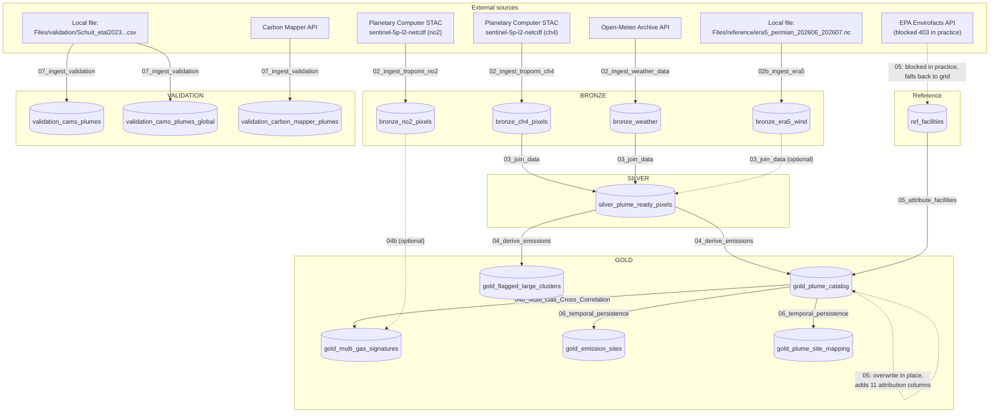

# Green Sky — Architecture (Varon et al Approach)

Generated by reading `notebook-content.py` for every notebook under:

```
Methane Emissions/Accelerator/Planetary Computer/Varon et al Approach/notebooks/
```

`archive/` subtrees are reference-only per project convention and are excluded from the
lineage/column analysis below. `changelog.Notebook` (sibling of `notebooks/`, not under it)
is a human-maintained log, not a pipeline step; it was used only to cross-check row/column
counts quoted here, and every count below was independently derived from the code.

All paths below are relative to
`Methane Emissions/Accelerator/Planetary Computer/Varon et al Approach/`.

---

## 1. Notebook table

| Notebook | Purpose | Reads (tables / files / APIs) | Writes |
|---|---|---|---|
| `notebooks/00_prereqs/00_config.Notebook` | Central `CONFIG` dict + `BBOX` accessor. `%run` target for every other notebook. | — | — (defines `CONFIG`, `BBOX` in notebook scope only) |
| `notebooks/00_prereqs/00_preflight_tests.Notebook` | Standalone environment/connectivity diagnostic notebook (STAC reachability, Open-Meteo, CDS API, Delta write smoke test, xarray/netCDF4 versions, Spark sizing, CDSE fallback exploration). **Does not `%run 00_config`** and is not depended on by any pipeline notebook. | `Planetary_computer_LH.bronze.planetary_comp_raw_data` (a table in the archived V1 lakehouse, not `greensky_lakehouse`); various external APIs (Planetary Computer STAC, Open-Meteo, CDS, CDSE STAC/OData/S3) | `test_write_check` (created then immediately `DROP TABLE IF EXISTS` in the same cell — ephemeral) |
| `notebooks/02_ingest/02_ingest_tropomi_ch4.Notebook` | Ingest Sentinel-5P/TROPOMI CH₄ pixels via Planetary Computer STAC, QA + BBOX filter, incremental load. | Planetary Computer STAC (`sentinel-5p-l2-netcdf`, product `ch4`); `bronze_ch4_pixels` (to compute already-ingested `stac_id`s) | `bronze_ch4_pixels` (append if table exists, else overwrite) |
| `notebooks/02_ingest/02_ingest_tropomi_no2.Notebook` | Ingest Sentinel-5P/TROPOMI NO₂ pixels via Planetary Computer STAC, QA + BBOX filter, incremental load with batch checkpointing. | Planetary Computer STAC (`sentinel-5p-l2-netcdf`, product `no2`); `bronze_no2_pixels` | `bronze_no2_pixels` (append if table exists, else overwrite; written every 5 items and once more at the end) |
| `notebooks/02_ingest/02_ingest_weather_data.Notebook` | Query Open-Meteo archive API on a 0.5° grid over the BBOX for the config date range; backfill any grid points that failed. | Open-Meteo Archive API; `bronze_weather` (to find missing grid points for backfill) | `bronze_weather` (overwrite on first write, then `append` for the backfill cell) |
| `notebooks/02_ingest/02b_ingest_era5.Notebook` | Parse a manually-staged ERA5 NetCDF file, standardize column names, write to Bronze. | Local file `/lakehouse/default/Files/reference/era5_permian_202606_202607.nc` (not produced by any notebook — manually uploaded) | `bronze_era5_wind` (overwrite) |
| `notebooks/03_joins/03_join_data.Notebook` | Spatial+temporal join of CH₄ pixels with nearest Open-Meteo weather record and nearest ERA5 wind grid point; decomposes wind to u/v. | `bronze_ch4_pixels`, `bronze_weather`, `bronze_era5_wind` (optional — nulls substituted if absent) | `silver_plume_ready_pixels` (overwrite) |
| `notebooks/04_core_logic/04_derive_emissions.Notebook` | Core detection/quantification pipeline: scene separation → kNN background → MAD candidate detection → Union-Find clustering → wind alignment → IME → wind-dependent emission rate → Monte Carlo uncertainty → confidence scoring. | `silver_plume_ready_pixels` | `gold_plume_catalog` (overwrite), `gold_flagged_large_clusters` (overwrite, only if any large clusters were flagged) |
| `notebooks/04_core_logic/04b_Multi_Gas_Cross_Correlation.Notebook` | For each CH₄ plume, checks for co-located/background NO₂ anomalies and classifies an emission signature (Fugitive Leak / Incomplete Combustion / Undetermined). | `gold_plume_catalog`; `bronze_no2_pixels` (optional — all-`Undetermined` fallback if absent) | `gold_multi_gas_signatures` (overwrite) |
| `notebooks/05_facility_attribution/05_attribute_facilities .Notebook` (trailing space before `.Notebook` in the folder name) | Pull O&G facility locations from EPA Envirofacts (Texas/New Mexico, GHGRP Subpart W); fall back to a synthetic 0.5° grid if the API is blocked. Wind-aware probabilistic attribution of each plume to a facility. | EPA Envirofacts API (`V_GHG_EMITTER_FACILITIES`); `gold_plume_catalog` | `ref_facilities` (overwrite); **updates `gold_plume_catalog` in place** (overwrite + `overwriteSchema=true`, adding 11 attribution columns) |
| `notebooks/06_temporal/06_temporal_persistence.Notebook` | Greedy proximity-based clustering of plumes into "emission sites" across the observation window; classifies persistence (single/intermittent/persistent/chronic). | `gold_plume_catalog` (post-05, with attribution columns) | `gold_emission_sites` (overwrite), `gold_plume_site_mapping` (overwrite). Final validation cell also reads `bronze_ch4_pixels` **under the wrong name `bronze_methane_pixels`** (table does not exist → `AnalysisException`), plus `bronze_weather`, `bronze_era5_wind`, `silver_plume_ready_pixels`, `gold_plume_catalog`, `gold_emission_sites`, `gold_flagged_large_clusters` |
| `notebooks/07_validation/07_ingest_validation.Notebook` | Ingest third-party validation datasets: CAMS/SRON 2021 global plume catalog (local CSV), Carbon Mapper API plumes, EMIT collection reachability check (no ingestion). Independent of the CH₄ pipeline outputs — only needs `BBOX`/`CONFIG`. | Local file `/lakehouse/default/Files/validation/Schuit_etal2023_TROPOMI_all_plume_detections_2021.csv`; Carbon Mapper API (`api.carbonmapper.org`); NASA CMR STAC (EMIT, reachability only, no write) | `validation_cams_plumes` (overwrite+overwriteSchema, Permian-BBOX-filtered subset), `validation_cams_plumes_global` (overwrite+overwriteSchema, unfiltered), `validation_carbon_mapper_plumes` (overwrite) |

---

## 2. Table lineage



Notes on the diagram:
- `gold_plume_catalog` is not a single linear hand-off: `04_derive_emissions` creates it, then
  `05_attribute_facilities` **overwrites the same table** with 11 additional attribution
  columns (`overwriteSchema=true`). Anything reading `gold_plume_catalog` gets a different
  schema depending on whether it runs before or after step 05.
- `validation_*` tables and `00_preflight_tests` are disconnected from the bronze→silver→gold
  chain — they don't read pipeline outputs and nothing downstream reads them back in any
  notebook currently in the repo (no `08_validation_crossmatch` notebook exists yet).

---

## 3. Exact column lists (as written by the code)

### `bronze_ch4_pixels` — `02_ingest_tropomi_ch4.Notebook`, lines 277–285, 230
`latitude, longitude, ch4, qa_value, datetime, stac_id, gas`

### `bronze_no2_pixels` — `02_ingest_tropomi_no2.Notebook`, lines 95–103, 268–269
`latitude, longitude, no2, qa_value, datetime, stac_id, gas`
(`no2` comes from `MEASUREMENT_COL`, line 84)

### `bronze_weather` — `02_ingest_weather_data.Notebook`, lines 103–112
`weather_lat, weather_lon, time, wind_speed_10m, wind_direction_10m, temperature_2m, relative_humidity_2m, surface_pressure`

### `bronze_era5_wind` — `02b_ingest_era5.Notebook`, lines 88–191
Guaranteed columns (built by string-matching the source NetCDF's own variable/coordinate
names, case-insensitively, lines 110–137): `era5_lat, era5_lon, era5_time, u10, v10, boundary_layer_height, surface_pressure_era5`.
**Caveat:** the rename map only touches columns whose lowercased name matches one of the
patterns in lines 111–120 / 126–134. Any other variable/coordinate present in the source
`.nc` file (e.g. an ensemble `number`, `expver`, or a differently-named coordinate) passes
through to the table **unrenamed**, so the true column set is a function of whatever the
manually-staged NetCDF file actually contains, not just the 7 listed above.

### `silver_plume_ready_pixels` — `03_join_data.Notebook`, lines 287–312
`latitude, longitude, ch4, qa_value, datetime, stac_id, gas, wind_speed_10m, wind_direction_10m, wind_u, wind_v, temperature_2m, relative_humidity_2m, surface_pressure, weather_weight, weather_dist_km, era5_u10, era5_v10, era5_blh`
— **19 columns.** (`weather_dist_km` ← aliased from `dist_km`; `era5_u10`/`era5_v10`/`era5_blh` ← aliased from `u10`/`v10`/`boundary_layer_height`.) Note: `changelog.Notebook` (Day 2 entry) states "20 columns" for this table; the code as it stands today produces 19 — treated the code as ground truth per the task's instruction.

### `gold_plume_catalog` — two writers, two schemas

**As written by `04_derive_emissions.Notebook`** (lines 785–809), 28 columns:
`plume_id, scene_id, stac_id, detection_date, source_lat, source_lon, n_pixels, plume_area_km2, peak_ch4_enhancement_ppb, mean_ch4_enhancement_ppb, ime_kg, emission_rate_kg_s, emission_rate_kg_h, emission_rate_t_h, emission_rate_p5_kg_s, emission_rate_p50_kg_s, emission_rate_p95_kg_s, emission_rate_p5_kg_h, emission_rate_p50_kg_h, emission_rate_p95_kg_h, t_mix_s, t_mix_method, U_eff_ms, L_m, wind_alignment_deg, wind_confidence, uncertainty_ratio, confidence`

**As overwritten by `05_attribute_facilities .Notebook`** (lines 449–478), the above 28 columns
plus 11 attribution columns = **39 columns total**:
`attributed_facility_id, attributed_facility_name, attributed_facility_lat, attributed_facility_lon, attribution_probability, attribution_distance_km, attribution_angular_offset_deg, attribution_method, facilities_in_range, second_facility_id, second_facility_probability`

### `gold_flagged_large_clusters` — `04_derive_emissions.Notebook`, lines 816–819
`plume_id, scene_id, latitude, longitude, ch4, ch4_enhancement, plume_flag, aspect_ratio` — 8 columns. Only written if at least one cluster exceeded `max_cluster_pixels` (15); the `.write` call is skipped entirely otherwise.

### `gold_multi_gas_signatures` — `04b_Multi_Gas_Cross_Correlation.Notebook`, lines 293–361, 381–384
Base columns selected from `gold_plume_catalog` (lines 294–305):
`plume_id, source_lat, source_lon, detect_ts, scene_id, plume_area_km2, ime_kg, emission_rate_kg_s, wind_alignment_deg, wind_confidence`

Plus, always present regardless of whether NO₂ data was available (populated with NO₂ values
when available, else explicit nulls — lines 316–361):
`no2_bg_mean, no2_bg_std, no2_bg_pixel_count, no2_co_located_mean, no2_co_located_max, no2_co_located_count, no2_anomaly_threshold, no2_elevated, emission_signature`

**Bug affecting this column list:** the select at lines 299–304 filters against the literal
names `pixel_count`, `peak_enhancement_ppb`, `mean_enhancement_ppb` — but `gold_plume_catalog`
actually contains `n_pixels`, `peak_ch4_enhancement_ppb`, `mean_ch4_enhancement_ppb` (see
above). Because the check is a silent `if c in [...]` membership test with no error path,
these three fields are silently dropped rather than copied through. `n_pixels`,
`peak_ch4_enhancement_ppb`, and `mean_ch4_enhancement_ppb` are **never written** to
`gold_multi_gas_signatures` despite being in the intended column list.

Also: the notebook's own markdown docstring (lines 34–36) says its input is `gold_plumes`;
the code actually reads `gold_plume_catalog` (line 99). Stale doc reference, not a functional
bug.

### `ref_facilities` — `05_attribute_facilities .Notebook`, lines 235–237
Schema is dynamic — `permian_fac` is either:
- the raw EPA Envirofacts response with `facility_lat`/`facility_lon` (and, if present,
  `facility_name`/`facility_id`) renamed in place, all other EPA-returned fields passed
  through unchanged (lines 169–179); or
- the synthetic fallback grid, in which case the table is **exactly**
  `facility_id, facility_name, facility_lat, facility_lon` (4 columns) — lines 202–214.

Per `changelog.Notebook`, the EPA API is blocked (403) in the current environment, so the
live table is the 4-column fallback.

### `gold_emission_sites` — `06_temporal_persistence.Notebook`, lines 173–191, 267–273
`site_id, site_lat, site_lon, detection_count, first_detection, last_detection, observation_span_days, persistence, avg_emission_rate_kg_h, max_emission_rate_kg_h, total_ime_kg, dominant_confidence, attributed_facility, detection_dates, plume_ids` — 15 columns. (`detection_dates` and `plume_ids` are stringified lists, not arrays.)

### `gold_plume_site_mapping` — `06_temporal_persistence.Notebook`, lines 276–289
`plume_id, site_id` — 2 columns.

### `validation_cams_plumes` / `validation_cams_plumes_global` — `07_ingest_validation.Notebook`, lines 174–188
Schema is dynamic (driven by the source CSV's own columns, lines 85–120). Columns the code
guarantees whenever the source CSV has a matching field: `cams_lat, cams_lon, cams_date, cams_emission_rate_th, cams_emission_rate_kgh` always; `cams_source_type` and `cams_uncertainty_th`/`cams_uncertainty_kgh` only if the CSV has a matching source/uncertainty column. Any CSV column that doesn't match one of the patterns in lines 87–99 is carried through **unrenamed**. `validation_cams_plumes` is the BBOX±0.5°-filtered subset; `validation_cams_plumes_global` is the full unfiltered CSV — both share the same derived schema.

### `validation_carbon_mapper_plumes` — `07_ingest_validation.Notebook`, lines 484–495, 559–564
`cm_plume_id, cm_lat, cm_lon, cm_gas, cm_emission_rate, cm_emission_uncertainty, cm_datetime, cm_sensor, cm_source_name, cm_sector` — 10 columns, fixed (constructed explicitly per-record from the Carbon Mapper API's JSON response, with several fields having a documented fallback key, e.g. `emission_rate` → `emission_auto`).

### Computed but never written to any table

- **`04_derive_emissions.Notebook`**: per-pixel `ch4_background` and `ch4_enhancement`
  (step 2, lines 187–188) — only plume-level aggregates (`peak_ch4_enhancement_ppb`,
  `mean_ch4_enhancement_ppb`) reach Gold; per-pixel values do not. Also per-scene
  `detection_threshold` and `scene_mad` (step 3, lines 236–237), the pixel-level
  `is_candidate` flag, and per-valid-plume `aspect_ratio` (step 4, line 375 — only the
  *flagged large cluster* `aspect_ratio` is written, via `gold_flagged_large_clusters`).
  From step 5's `wind_df` (lines 456–463): `plume_orientation_deg`, `wind_direction_deg`,
  and `era5_wind_speed_ms` are computed but only `wind_alignment_deg`/`wind_confidence` are
  merged forward (line 592–595) and eventually written — the other three are dropped. From
  step 7's `wind_info` (lines 577–586): the per-plume mean `era5_u10`, `era5_v10`,
  `era5_blh`, `wind_speed_10m`, and the recomputed `era5_wind_speed` are merged into
  `ime_df` but excluded by the `gold_columns` allow-list (only the renamed `U_eff_ms`
  survives).
- **`04b_Multi_Gas_Cross_Correlation.Notebook`**: see the bug note above —
  `n_pixels`/`peak_ch4_enhancement_ppb`/`mean_ch4_enhancement_ppb` are computed upstream and
  present in `plumes` but dropped by the name-mismatched select.

---

## 4. Execution sequence

```
Phase 0   00_config                         (sourced via %run by every notebook below; never run standalone)

Phase 1   02_ingest_tropomi_ch4    ┐
          02_ingest_tropomi_no2    │  no dependencies on each other or on any
          02_ingest_weather_data   │  bronze/silver/gold table — can all run
          02b_ingest_era5          │  in parallel
          07_ingest_validation     ┘  (independent of the CH4 pipeline entirely)

Phase 2   03_join_data
          — requires bronze_ch4_pixels + bronze_weather (hard);
            bronze_era5_wind is optional (nulls substituted if the table
            doesn't exist yet), so it does not strictly block Phase 2,
            but should have run first for a complete join.

Phase 3   04_derive_emissions
          — requires silver_plume_ready_pixels

Phase 4   04b_Multi_Gas_Cross_Correlation  ┐  both only require gold_plume_catalog
          05_attribute_facilities          ┘  from 04. NOT safe to run truly
                                               concurrently: 05 overwrites
                                               gold_plume_catalog with
                                               overwriteSchema=true while 04b
                                               is reading it. Run sequentially
                                               (order between the two doesn't
                                               matter functionally — 04b never
                                               uses the attribution columns —
                                               but they must not overlap in time).
          (04b also needs bronze_no2_pixels from Phase 1, optional.)

Phase 5   06_temporal_persistence
          — requires gold_plume_catalog as left by 05 (uses
            attributed_facility_name if present); its own final validation
            cell will throw on bronze_methane_pixels (see notebook table,
            known bug — does not block the two table writes earlier in the
            same notebook, which complete first).
```

`00_preflight_tests.Notebook` is not part of this sequence — it is a manual diagnostic
notebook, does not `%run 00_config`, and nothing depends on its output.

---

## 5. Hard-coded constants (not sourced from `00_config`)

| Notebook | Line(s) | Constant | Value |
|---|---|---|---|
| `00_prereqs/00_preflight_tests.Notebook` | 755 | CDS API key | `"cdfeae22-35a3-473c-b462-cb9cdf5bf690"` — **secret in source** |
| `02_ingest/02_ingest_tropomi_no2.Notebook` | 86 | `PROCESSING_MODES` | `["OFFL"]` |
| `02_ingest/02_ingest_tropomi_no2.Notebook` | 87 | `QA_THRESHOLD` | `0.75` (CH₄'s equivalent notebook uses `CONFIG["qa_threshold"]`; NO₂'s own threshold has no config key) |
| `02_ingest/02_ingest_tropomi_no2.Notebook` | 90 | `CONNECT_TIMEOUT` | `15` s |
| `02_ingest/02_ingest_tropomi_no2.Notebook` | 91 | `READ_TIMEOUT` | `120` s |
| `02_ingest/02_ingest_tropomi_no2.Notebook` | 92 | `BATCH_SIZE` | `5` items |
| `02_ingest/02_ingest_weather_data.Notebook` | 124 | Open-Meteo rate-limit sleep | `0.15` s |
| `02_ingest/02_ingest_weather_data.Notebook` | 263, 265, 287 | Backfill retry policy | `3` attempts, `120` s timeout, `2` s inter-attempt sleep |
| `02_ingest/02b_ingest_era5.Notebook` | 50 | Source NetCDF path (date range baked into filename) | `/lakehouse/default/Files/reference/era5_permian_202606_202607.nc` |
| `03_joins/03_join_data.Notebook` | 188–189, 247–248 | deg→km conversion | `111.0` (lat), `94.0` (lon) |
| `03_joins/03_join_data.Notebook` | 196 | Weather Gaussian-decay sigma | `50.0` km |
| `04_core_logic/04_derive_emissions.Notebook` | 288 | Haversine Earth radius | `6371.0` km |
| `04_core_logic/04_derive_emissions.Notebook` | 424–425 | deg→km conversion (plume PCA) | `111.0`, `94.0` |
| `04_core_logic/04_derive_emissions.Notebook` | 228 | MAD→sigma scale factor | `1.4826` |
| `04_core_logic/04_derive_emissions.Notebook` | 497 | TROPOMI pixel area | `5500.0 * 7000.0` m² (pre-Aug-2019 pixel size — tracked known issue) |
| `04_core_logic/04_derive_emissions.Notebook` | 498 | Dry-air column | `2.12e25` molecules/m² |
| `04_core_logic/04_derive_emissions.Notebook` | 499 | Avogadro's number | `6.022e23` |
| `04_core_logic/04_derive_emissions.Notebook` | 500 | CH₄ molar mass | `16.04e-3` kg/mol |
| `04_core_logic/04_derive_emissions.Notebook` | 501 | Air molar mass | `28.97e-3` kg/mol — **defined but never used** in the `PPB_TO_KG` formula (line 505) |
| `04_core_logic/04_derive_emissions.Notebook` | 521 | Plume area per pixel (duplicate of line 497, expressed differently) | `5.5 * 7.0` km² |
| `04_core_logic/04_derive_emissions.Notebook` | 672 | TROPOMI CH₄ retrieval noise | `10.0` ppb |
| `04_core_logic/04_derive_emissions.Notebook` | 877 | Plausibility check threshold | `100` t/h |
| `04_core_logic/04b_Multi_Gas_Cross_Correlation.Notebook` | 73 | `SPATIAL_RADIUS_DEG` | `0.15` (~15 km) |
| `04_core_logic/04b_Multi_Gas_Cross_Correlation.Notebook` | 74 | `TEMPORAL_WINDOW_S` | `3600` s |
| `04_core_logic/04b_Multi_Gas_Cross_Correlation.Notebook` | 75 | `NO2_BACKGROUND_RADIUS_DEG` | `0.5` |
| `04_core_logic/04b_Multi_Gas_Cross_Correlation.Notebook` | 76 | `NO2_ANOMALY_SIGMA` | `2.0` |
| `05_facility_attribution/05_attribute_facilities .Notebook` | 159 | BBOX padding for EPA facility filter | `0.3` deg |
| `05_facility_attribution/05_attribute_facilities .Notebook` | 254 | Haversine Earth radius | `6371.0` km |
| `05_facility_attribution/05_attribute_facilities .Notebook` | 318 | Facility-distance Gaussian-decay sigma | `15.0` km |
| `06_temporal/06_temporal_persistence.Notebook` | 72 | Haversine Earth radius | `6371.0` km |
| `06_temporal/06_temporal_persistence.Notebook` | 147, 149 | Persistence classification thresholds | `2` detections = "intermittent"; span `<= 30` days = "persistent", else "chronic" |
| `06_temporal/06_temporal_persistence.Notebook` | 349 | Flagged-cluster count in summary print | hard-coded literal `20` (not read from `gold_flagged_large_clusters`, so it silently goes stale) |
| `07_validation/07_ingest_validation.Notebook` | 52 | CAMS CSV path | `/lakehouse/default/Files/validation/Schuit_etal2023_TROPOMI_all_plume_detections_2021.csv` |
| `07_validation/07_ingest_validation.Notebook` | 138 | BBOX padding for CAMS filter | `0.5` deg |
| `07_validation/07_ingest_validation.Notebook` | 286 | Carbon Mapper API bearer token | full JWT literal — **secret in source** |
| `07_validation/07_ingest_validation.Notebook` | 393–394 | Carbon Mapper pagination | `page_size = 100`, `max_plumes = 2000` cap |

The two secrets above (CDS API key, Carbon Mapper token) are the "two violations pending
cleanup" referenced in the project's `CLAUDE.md`.
