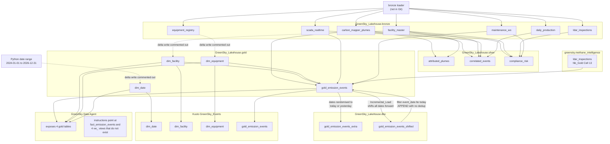

# GreenSky_Lakehouse — Enterprise Data Model Survey

Static analysis from the repo, ahead of designing a new SCADA / facility data-generation
layer. Source material:

| Item | Path |
|---|---|
| `Incremental_Load` | `Methane Emissions/Accelerator/Notebooks/Incremental_Load.Notebook/notebook-content.py` |
| `Nb_Bronze_to_Silver` | `Methane Emissions/Accelerator/Notebooks/Nb_Bronze_to_Silver.Notebook/notebook-content.py` |
| `Nb_Gold` | `Methane Emissions/Accelerator/Notebooks/Nb_Gold.Notebook/notebook-content.py` |
| `GreenSky Data Agent` | `Methane Emissions/Accelerator/GreenSky Data Agent.DataAgent/Files/Config/**` |

All three notebooks bind the same default lakehouse:

```
default_lakehouse            427f0431-b084-4858-82dd-1bfa55380658
default_lakehouse_name       GreenSky_Lakehouse
default_lakehouse_workspace  060ba34b-f1a3-4509-a6e2-36d1e736a8eb
```

**This is not the V2 workspace.** CLAUDE.md records the Varon-et-al V2 work in workspace
`640876ea-6158-4ffd-8598-5eb210e088a0`. `GreenSky_Lakehouse` lives in `060ba34b-…`, so the
accelerator model and the V2 pipeline are in separate workspaces and share no tables.

The Data Agent datasource records `artifactId: 55380658-1bfa-82dd-4858-b084427f0431`. That is
the same GUID as the notebooks' `default_lakehouse` with its segments written in reverse
order — same lakehouse, not a second one.

---

## 1. Table inventory and access matrix

`R` = read, `W` = write, `DDL` = `CREATE TABLE IF NOT EXISTS` only, `—` = not referenced.

### schema `bronze` — 7 tables, read-only everywhere in this repo

Nothing in the repo creates or loads these. They are pre-existing inputs; the loader is not
in Git.

| Table | Incremental_Load | Nb_Bronze_to_Silver | Nb_Gold |
|---|---|---|---|
| `bronze.carbon_mapper_plumes` | — | R | R |
| `bronze.facility_master` | — | R | R |
| `bronze.equipment_registry` | — | — | R |
| `bronze.scada_realtime` | — | R | R |
| `bronze.daily_production` | — | R | R |
| `bronze.maintenance_wo` | — | R | R |
| `bronze.ldar_inspections` | — | R | — (see §1.5) |

### schema `silver` — 3 tables, all written by Nb_Bronze_to_Silver

| Table | Incremental_Load | Nb_Bronze_to_Silver | Nb_Gold |
|---|---|---|---|
| `silver.attributed_plumes` | — | W | — |
| `silver.correlated_events` | — | W | — |
| `silver.compliance_risk` | — | R + W | — |

`silver.compliance_risk` is read by a `SELECT * … LIMIT 1000` display cell that sits *above*
the cell that writes it — a leftover inspection cell, not a dependency.

### schema `gold` — 4 tables

| Table | Incremental_Load | Nb_Bronze_to_Silver | Nb_Gold |
|---|---|---|---|
| `gold.gold_emission_events` | R + W (append) | — | DDL + R-via-self + W (overwrite ×2) |
| `gold.dim_facility` | R | — | DDL + R; **delta write commented out** |
| `gold.dim_equipment` | R | — | DDL + R; **delta write commented out** |
| `gold.dim_date` | R | — | DDL; **delta write commented out** |

### schema `dbo` — 2 tables

| Table | Incremental_Load | Nb_Bronze_to_Silver | Nb_Gold |
|---|---|---|---|
| `dbo.gold_emission_events_extra` | R | — | W (overwrite) |
| `dbo.gold_emission_events_shifted` | R + W (overwrite) | — | — |

### 1.5 Off-lakehouse and phantom references

| Reference | Where | Note |
|---|---|---|
| `greensky.methane_intelligence.ldar_inspections` | Nb_Gold Cell 13 | `spark.table(f"{LAKEHOUSE}.methane_intelligence.ldar_inspections")` with `LAKEHOUSE = "greensky"`. A **fourth schema namespace** under a **differently-named lakehouse**. Nb_Bronze_to_Silver reads the same concept from `GreenSky_Lakehouse.bronze.ldar_inspections`. One of the two is wrong. |
| Kusto `GreenSky_Events` | Nb_Gold ×5 | Cluster `https://trd-b5gpfrcqchk3m40g53.z2.kusto.fabric.microsoft.com`. Tables `dim_date`, `dim_facility`, `dim_equipment` (twice), `gold_emission_events`, all `mode("Append")` with `tableCreateOptions=CreateIfNotExist`. These are the *only* writes that actually land for the three dimensions. |
| `gold.fact_emission_events` | Data Agent instructions + few-shot | **Does not exist.** The real table is `gold.gold_emission_events`. |
| `gold.fact_daily_facility_summary` | Data Agent instructions | **Does not exist** anywhere in the repo. |
| `gold.vw_active_super_emitters`, `vw_facility_emission_trends`, `vw_roi_opportunities`, `vw_compliance_dashboard` | Data Agent instructions | **Do not exist** in the datasource element tree, and no notebook creates them. |

---

## 2. Column lists

Types below come from the Data Agent's `datasource.json` element tree, which is a dump of the
**physical** lakehouse schema (SQL-endpoint types), cross-checked against the notebook DDL and
the selects that write each table. Where the DDL and the physical schema disagree, both are
shown — this matters, see §2.3.

### 2.1 bronze (physical schema; no DDL in repo)

**`bronze.facility_master`** — 14 columns

```
facility_id            varchar      business key, format "WP-001"
facility_name          varchar      e.g. "Well Pad A-01"
facility_type          varchar
latitude               decimal
longitude              decimal
basin                  varchar      'PERMIAN'
operator               varchar      Occidental, XTO Energy, …
production_start_date  date
daily_oil_bbl          decimal
daily_gas_mcf          decimal
well_count             int
active_status          varchar      'ACTIVE' | 'IDLE'
epa_facility_id        varchar
last_updated           datetime2
```

**`bronze.scada_realtime`** — 10 columns. Tall / EAV shape, one row per reading.

```
reading_id         bigint
facility_id        varchar
equipment_tag      varchar
measurement_type   varchar     'pressure' is the only value used by any notebook
measurement_value  decimal
unit_of_measure    varchar
quality_code       varchar
timestamp          datetime2
source_system      varchar
date               date        redundant with timestamp; likely a partition column
```

**`bronze.equipment_registry`** — 9 columns

```
equipment_id           varchar
facility_id            varchar
equipment_tag          varchar     e.g. "WP-001_SEP_001"
equipment_type         varchar     SEPARATOR, COMPRESSOR, HEATER, TANK, VALVE
manufacturer           varchar
model                  varchar
install_date           date
last_maintenance_date  date
criticality            varchar     CRITICAL, HIGH, MEDIUM, LOW
```

**`bronze.daily_production`** — 12 columns

```
production_date   date
facility_id       varchar
oil_volume_bbl    decimal
gas_volume_mcf    decimal
water_volume_bbl  decimal
gas_oil_ratio     decimal
oil_price         decimal
gas_price         decimal
revenue_oil       decimal
revenue_gas       decimal
total_revenue     decimal
boe               float
```

**`bronze.maintenance_wo`** — 14 columns

```
work_order_id   varchar
facility_id     varchar
equipment_tag   varchar
wo_type         varchar
priority        varchar
description     varchar
root_cause      varchar
status          varchar
created_date    datetime2
completed_date  datetime2
labor_hours     decimal
estimated_cost  decimal
actual_cost     decimal
category        varchar     'LEAK_REPAIR' is the only value used by any notebook
```

**`bronze.ldar_inspections`** — 15 columns

```
inspection_id         varchar
facility_id           varchar
inspection_date       date
inspector_name        varchar
inspection_type       varchar
components_inspected  int
leaks_found           int
leaks_repaired        int
leaks_delayed         int
max_ppm_detected      decimal
compliance_status     varchar
regulatory_deadline   date
next_inspection_due   date
days_since_inspection int
inspection_overdue    bit
```

**`bronze.carbon_mapper_plumes`** — 16 columns

```
plume_id                  varchar
plume_latitude            decimal
plume_longitude           decimal
datetime                  datetime2
ipcc_sector               varchar
gas                       varchar
emission_auto             decimal     kg/hr
emission_uncertainty_auto decimal
instrument                varchar
platform                  varchar
provider                  varchar
mission_phase             varchar
wind_speed_avg_auto       decimal
wind_direction_avg_auto   decimal
plume_bounds              varchar
emission_severity         varchar     SUPER_EMITTER | HIGH | MEDIUM | LOW
```

### 2.2 silver — written by Nb_Bronze_to_Silver

**`silver.attributed_plumes`** — 8 columns, from the `distances` CTE.

```
plume_id          varchar     bronze.carbon_mapper_plumes.plume_id
datetime          datetime2   bronze.carbon_mapper_plumes.datetime
emission_auto     decimal     bronze.carbon_mapper_plumes.emission_auto
emission_severity varchar     bronze.carbon_mapper_plumes.emission_severity
facility_id       varchar     bronze.facility_master.facility_id
facility_name     varchar     bronze.facility_master.facility_name
daily_gas_mcf     decimal     bronze.facility_master.daily_gas_mcf
distance_meters   float       haversine UDF, plume → facility, metres
```

**`silver.correlated_events`** — 12 columns.

```
plume_id              varchar
facility_id           varchar
facility_name         varchar
detection_time        datetime2   aliased from plumes.datetime
emission_kg_hr        decimal     ROUND(emission_auto, 2)
emission_severity     varchar
pressure_change_pct   decimal     ROUND(…, 2)
avg_pressure_psi      decimal     ROUND(…, 2)
production_change_pct decimal     ROUND(…, 2)
avg_oil_bbl_per_day   decimal     ROUND(…, 2)
anomaly_type          varchar     PRESSURE_AND_PRODUCTION | PRESSURE_ANOMALY | PRODUCTION_DECLINE | NO_ANOMALY
risk_level            varchar     CRITICAL | HIGH | MEDIUM | LOW
```

**`silver.compliance_risk`** — 12 columns.

```
facility_id           varchar
facility_name         varchar
detection_count       bigint
max_emission_kg_hr    decimal     ROUND(MAX(emission_auto), 2)
avg_emission_kg_hr    decimal     ROUND(AVG(emission_auto), 2)
days_since_inspection int         bronze.ldar_inspections
leaks_delayed         int         bronze.ldar_inspections
compliance_status     varchar     bronze.ldar_inspections
leak_repair_count     bigint      bronze.maintenance_wo, category='LEAK_REPAIR'
total_wo_count        bigint      bronze.maintenance_wo
compliance_risk_score int         0–12, see §3.1
risk_category         varchar     CRITICAL | HIGH | MEDIUM
```

### 2.3 gold — DDL vs physical schema

The four `CREATE TABLE IF NOT EXISTS` cells in Nb_Gold declare **narrower** tables than what is
physically present. The physical schemas match the shape of the *derived DataFrames*, not the
DDL — so the (now commented-out) delta writes did run at least once with
`overwriteSchema=true` and widened the tables. Re-running the DDL is a no-op because of
`IF NOT EXISTS`; anyone reading the DDL alone will design against the wrong table.

**`gold.gold_emission_events`** — DDL declares 14 columns; physical has 17.

| Column | Physical type | In DDL? | Source |
|---|---|---|---|
| `event_id` | varchar | yes | `concat('EVENT-', yyyyMMdd(detection_timestamp), '-', plume_id)` |
| `date_key` | int | **no** | `date_format(detection_date,'yyyyMMdd')::int` |
| `event_date` | date | yes | `to_date(plumes.datetime)` |
| `detection_timestamp` | datetime2 | **no** | `plumes.datetime` |
| `facility_key` | bigint | yes (as INT) | `dim_facility.facility_key` |
| `equipment_key` | bigint | yes (as INT) | `coalesce(dim_equipment.equipment_key, -1)` |
| `emission_kg_per_hour` | decimal | yes | `plumes.emission_auto` |
| `emission_severity` | varchar | yes | `plumes.emission_severity` |
| `duration_hours` | float | yes (DECIMAL(8,2)) | `lit(24.0)` — constant |
| `total_methane_loss_mcf` | float | yes (DECIMAL(18,2)) | `round(emission_kg_per_hour * 24 / 19.01, 2)` |
| `financial_impact_usd` | float | yes (DECIMAL(18,2)) | `round(total_methane_loss_mcf * 2.50, 2)` |
| `compliance_risk_score` | int | yes | see §3.2 |
| `scada_anomaly_detected` | int | yes (as BOOLEAN) | `1` if a SCADA row joined, else `0` |
| `work_order_generated` | varchar | yes | first element of `collect_list(work_order_id)` |
| `detection_source` | varchar | yes | `lit('SATELLITE')` — constant |
| `response_time_hours` | float | yes (DECIMAL(8,2)) | `lit(None)` — **always NULL** |
| `distance_meters` | float | **no** | haversine UDF |

Type drift worth noting: the DDL says `facility_key INT` / `scada_anomaly_detected BOOLEAN` /
`DECIMAL(18,2)`; the physical table is `bigint` / `int` / `float`.

**`gold.dim_facility`** — DDL declares 8 columns; physical has 18.

| Column | Physical type | In DDL? | Source |
|---|---|---|---|
| `facility_key` | bigint | yes (INT) | `monotonically_increasing_id()` |
| `facility_id` | varchar | yes | `facility_master.facility_id` |
| `facility_name` | varchar | yes | passthrough |
| `facility_type` | varchar | **no** | passthrough |
| `basin` | varchar | yes | passthrough |
| `operator` | varchar | **no** | passthrough |
| `latitude` | decimal | yes | passthrough |
| `longitude` | decimal | yes | passthrough |
| `production_start_date` | date | **no** | passthrough |
| `daily_oil_bbl` | decimal | **no** | passthrough |
| `daily_gas_mcf` | decimal | **no** | passthrough |
| `well_count` | int | **no** | passthrough |
| `active_status` | varchar | **no** | passthrough |
| `epa_facility_id` | varchar | **no** | passthrough |
| `facility_age_days` | int | **no** | `datediff(current_date(), production_start_date)` |
| `facility_age_years` | int | yes | `datediff(…) / 365` cast int |
| `production_tier` | varchar | yes | `daily_oil_bbl > 2000 → HIGH`, `> 1000 → MEDIUM`, else `LOW` |
| `daily_boe` | float | **no** | `daily_oil_bbl + daily_gas_mcf / 6.0` |

**`gold.dim_equipment`** — DDL declares 5 columns; physical has 13.

| Column | Physical type | In DDL? | Source |
|---|---|---|---|
| `equipment_key` | bigint | yes (INT) | `monotonically_increasing_id()` |
| `equipment_id` | varchar | **no** | passthrough |
| `facility_id` | varchar | **no** | passthrough |
| `equipment_tag` | varchar | yes | passthrough |
| `equipment_type` | varchar | yes | passthrough |
| `manufacturer` | varchar | yes | passthrough |
| `model` | varchar | **no** | passthrough |
| `install_date` | date | **no** | passthrough |
| `last_maintenance_date` | date | **no** | passthrough |
| `criticality` | varchar | yes | passthrough |
| `equipment_age_days` | int | **no** | `datediff(current_date(), install_date)` |
| `equipment_age_years` | int | **no** | `datediff(…) / 365` cast int |
| `days_since_maintenance` | int | **no** | `9999` when `last_maintenance_date IS NULL`, else `datediff(…)` |

**`gold.dim_date`** — DDL declares 6 columns; physical has 11; the Python builds 11.

| Column | Physical type | In DDL? | Source |
|---|---|---|---|
| `date_key` | int | yes | `int(d.strftime('%Y%m%d'))` |
| `full_date` | date | yes | `d` |
| `year` | int | yes | `d.year` |
| `quarter` | int | yes | `(d.month - 1) // 3 + 1` |
| `month` | int | yes | `d.month` |
| `day` | int | **no** | `d.day` |
| `week_of_year` | int | **no** | `d.isocalendar()[1]` |
| `day_of_week` | int | yes | `d.weekday() + 1` (1 = Monday) |
| `day_name` | varchar | **no** | `d.strftime('%A')` |
| `month_name` | varchar | **no** | `d.strftime('%B')` |
| `is_weekday` | int | **no** | `1` if `weekday() < 5` else `0` |

Grain: one row per day, `2024-01-01` → `2026-12-31` (1,096 rows).

### 2.4 dbo

**`dbo.gold_emission_events_extra`** — 17 columns, identical to `gold.gold_emission_events`.
Written by Nb_Gold's last frozen cell as `df_updated` — i.e. the date-randomised copy.

**`dbo.gold_emission_events_shifted`** — 17 columns, identical again. Written by
Incremental_Load as the date-shifted copy. **Not present in the Data Agent element tree**, so
it was created after the agent's schema snapshot.

---

## 3. Transformation logic

### 3.1 Nb_Bronze_to_Silver

Three independent, self-contained sections. Each re-reads
`bronze.carbon_mapper_plumes` and `bronze.facility_master` and re-registers the same temp
views (the notebook calls this "standalone — no dependencies on other notebooks").

**`silver.attributed_plumes`** ← `carbon_mapper_plumes` × `facility_master`

- `CROSS JOIN` plumes to facilities, distance from a Python **haversine UDF** registered both
  as a DataFrame UDF and via `spark.udf.register("distance_meters", …)`.
- Business rule: keep pairs where `distance_meters <= 100` **metres** and not null.
- No dedup — one plume within 100 m of two facilities produces two rows.
- Write: `mode("overwrite")`.

**`silver.correlated_events`** ← plumes × facilities × `scada_realtime` × `daily_production`

- `plume_facilities` CTE re-does the geospatial join, but with **equirectangular
  approximation instead of haversine**: `sqrt((Δlon·111000·cos(lat))² + (Δlat·111000)²) <= 100`.
  Same 100 m rule, different maths from the cell above it.
- `scada_pressure_analysis`: over `bronze.scada_realtime` where `measurement_type='pressure'`
  and value not null, ranks rows per `facility_id` by `timestamp`, computes
  `(last − first) / first × 100`. `HAVING … < -10` — **keeps only facilities whose pressure
  fell more than 10 %**.
- `production_decline_analysis`: same first/last ranking over `bronze.daily_production` by
  `production_date` on `oil_volume_bbl`. `HAVING … < -10` — **keeps only facilities whose oil
  production fell more than 10 %**.
- Joined `LEFT` onto the plume-facility pairs, then filtered
  `WHERE sa.facility_id IS NOT NULL OR pd.facility_id IS NOT NULL` — so the `LEFT JOIN` plus
  filter is effectively an inner join against the union of the two anomaly sets, and
  `anomaly_type = 'NO_ANOMALY'` is unreachable.
- `anomaly_type`: both non-null → `PRESSURE_AND_PRODUCTION`; pressure only →
  `PRESSURE_ANOMALY`; production only → `PRODUCTION_DECLINE`; else `NO_ANOMALY` (dead branch).
- `risk_level`: `SUPER_EMITTER` and `pressure_change_pct < -15` → `CRITICAL`;
  `SUPER_EMITTER` or (`pressure < -15` and `production < -15`) → `HIGH`;
  either anomaly present → `MEDIUM`; else `LOW` (also effectively dead).
- Write: `mode("overwrite")`.

**`silver.compliance_risk`** ← plumes × facilities × `ldar_inspections` × `maintenance_wo`

- `plume_facility_matches`: the equirectangular 100 m join again.
- `attributed_emissions`: `LEFT JOIN` from **all** facilities, aggregating
  `detection_count`, `MAX(emission_auto)`, `AVG(emission_auto)`.
- `work_order_history`: per facility, `COUNT(*)` and `SUM(category='LEAK_REPAIR')`.
- Score (additive, 0–12):

  | Condition | Points |
  |---|---|
  | `detection_count > 0` | +3 |
  | `max_emission > 2000` | +3 |
  | `days_since_inspection > 90` | +2 |
  | `leaks_delayed > 0` | +2 |
  | `leak_repair_count >= 3` | +2 |

- `risk_category`: `>= 7` → `CRITICAL`, `>= 4` → `HIGH`, else `MEDIUM`.
- Final filter `WHERE detection_count > 0`, then `dropDuplicates(['facility_id'])` in a
  separate Python cell — needed because `ldar_status` is joined without any uniqueness
  guarantee on `facility_id`.
- Write: `mode("overwrite")`.

### 3.2 Nb_Gold

Runs in four stages: DDL → dimensions → fact → date theatre.

**Dimensions.** `dim_date` is built in Python (1,096 rows), `dim_facility` from
`bronze.facility_master`, `dim_equipment` from `bronze.equipment_registry`. Derivations are in
§2.3. Surrogate keys come from `monotonically_increasing_id()`.

> **Every delta write for all three dimensions is commented out.** Only the Kusto `Append`
> writes are live. `dim_facility`'s commented write is `mode("append")`; the other two are
> `mode("overwrite")`. Yet Cell 6 reads `gold.dim_facility`, `gold.dim_equipment` and
> `gold.dim_date` back out of the lakehouse to build the fact. The notebook as committed
> cannot rebuild its own inputs.

**Fact — `gold.gold_emission_events`.**

1. *Geospatial attribution.* `plumes.crossJoin(facilities)` with the haversine UDF, filter
   `distance_meters <= 100`. Output carries `facility_key` from the gold dimension (so it
   inherits `monotonically_increasing_id()` values).
2. *SCADA "anomalies".* Filter `measurement_type == 'pressure'`, then
   `Window.partitionBy('facility_id','equipment_tag').orderBy('timestamp')` with `first()` /
   `last()`, compute `pressure_change_pct`, then `groupBy('facility_id','equipment_tag')`
   aggregating `avg(pressure_psi)` and `first(pressure_change_pct)`.
   **There is no threshold.** Every `(facility_id, equipment_tag)` pair with pressure readings
   survives, and the print still calls them "anomalies". Note also that the default window
   frame for `last()` is `UNBOUNDED PRECEDING → CURRENT ROW`, so `last_pressure` is the
   *current* row, not the series end — `pressure_change_pct` is not what the name says.
   Nb_Bronze_to_Silver computes the same quantity correctly and does threshold it at −10 %.
3. *Financial impact.* Constants in-cell: `GAS_PRICE = 2.50` $/MCF, `MCF_TO_KG = 19.01`,
   `METHANE_DENSITY = 0.0007168` (declared, never used). `duration_hours = 24.0` fixed.
   `total_methane_kg = rate × 24` → `÷ 19.01` → MCF → `× 2.50` → USD.
4. *SCADA join.* Joined to the fact on **`facility_id` only**, not `(facility_id,
   equipment_tag)` — so each plume fans out to one row per instrumented equipment tag at that
   facility. `scada_anomaly_detected = 1` whenever `pressure_change_pct` is non-null, i.e. for
   every facility with any pressure data.
5. *Equipment join.* `scada_equipment_tag == dim_equipment.equipment_tag`, left. This is the
   only path by which `equipment_key` is populated; unmatched → `-1` via `coalesce`.
6. *Compliance risk.* Reads LDAR from `greensky.methane_intelligence.ldar_inspections` (§1.5),
   scores `days_since_inspection > 90 → 3`, else `leaks_delayed > 0 → 2`, else `0`, then:

   | Condition | Points |
   |---|---|
   | `emission_severity = 'SUPER_EMITTER'` | +3 |
   | `scada_anomaly_detected = 1` | +2 |
   | LDAR points | +0 / +2 / +3 |

   Range 0–8. **This is a different formula from `silver.compliance_risk`'s 0–12 scale, under
   the same column name.**
7. *Work orders.* `maintenance_wo` filtered to `category = 'LEAK_REPAIR'`, `collect_list` per
   facility, `work_order_generated = element_at(list, 1)` — an arbitrary work order, joined on
   facility only, with no time relation to the detection.
8. *Constants.* `detection_source = 'SATELLITE'`, `response_time_hours = NULL`.
9. `.distinct()`, then `write.mode("overwrite").option("overwriteSchema","true")` to
   `gold.gold_emission_events`, then an `Append` to Kusto.

A `production_trends` DataFrame is computed from `bronze.daily_production`
(`avg_oil_bbl_per_day`, `avg_gas_mcf_per_day`, `production_change_pct`) and displayed, but is
never joined into the fact.

**Date theatre (frozen cells at the end).**

- A cell re-reads the fact and **randomly reassigns every `event_date` to today or yesterday**
  (`when(rand() > 0.5, today).otherwise(yesterday)`), rewrites `detection_timestamp` keeping
  only the original time-of-day, recomputes `date_key`, and rebuilds `event_id` via
  `substring(event_id, 17, 100)`. Then overwrites `gold.gold_emission_events` again.
- The same DataFrame is written to `dbo.gold_emission_events_extra`.

So `gold.gold_emission_events` does not hold real detection dates after a full run of Nb_Gold.

### 3.3 Incremental_Load

Opens with six ad-hoc `SELECT *` display cells against `dbo.gold_emission_events_extra`,
`gold.dim_date`, `gold.dim_equipment`, `gold.dim_facility` and `gold.gold_emission_events`.

The substance is a ~450-line date-shift library, then its application:

- `detect_date_columns()` classifies every column as `native_date`, `native_timestamp`,
  `int_date` (YYYYMMDD integers, ≥95 % of a 50-row sample), `str_date`, `str_timestamp`, or
  `str_event_id` (`^([A-Z]+-?)(\d{8})(-[A-Z]+-?)(\d{8})(-\d+)$`, ≥90 % of a 50-row sample).
- `find_global_min_max()` casts all detected columns to timestamp and takes one
  `least`/`greatest` pass.
- Offset: `(global_max + 1 day) − global_min`, in seconds. **The entire timeline is moved so
  that the oldest record lands one day after the newest record** — the history is relocated
  into the future, preserving relative gaps.
- `shift_date_columns()` applies the offset per classification, reconstructing `event_id` from
  its five regex groups with both embedded dates shifted independently.

Applied to `gold.gold_emission_events` → written to `dbo.gold_emission_events_shifted`
(`overwrite`) → re-read, filtered `event_date <= current_date()` → **appended** to
`gold.gold_emission_events`.

The commented-out write in the library cell targets `gold.gold_emission_events_shifted`; the
live cell two below writes `dbo.gold_emission_events_shifted` instead.

> Net effect: this is a synthetic-data treadmill that keeps a demo dashboard populated with
> "recent" events. `gold.gold_emission_events` grows on every run (append, no dedup on
> `event_id`), and its dates are fabricated twice over — once by Nb_Gold's random
> today/yesterday assignment, once by this shift. It is not an incremental load in the
> warehouse sense: there is no watermark, no merge, and no source-change detection.

---

## 4. What the Data Agent exposes

Item: `GreenSky Data Agent.DataAgent`, logicalId `cbdfcc61-d63d-8c4b-43e3-6d55d0a92d8d`.
Datasource `GreenSky_Lakehouse`, type `lakehouse_tables`.

### 4.1 Selected tables

`is_selected: true` appears on exactly four tables, in both draft and published:

| Exposed | Schema |
|---|---|
| `gold_emission_events` | gold |
| `dim_facility` | gold |
| `dim_equipment` | gold |
| `dim_date` | gold |

Every column of every table in the tree is marked selected, but the **table-level** flag is
what gates access — bronze, silver and dbo tables are all present in the tree and all
unselected. The agent can only query the four gold tables.

Draft vs published differ in tree shape: draft has one `schema_grouping` root ("Schemas")
covering **bronze, dbo, gold, silver**; published has three sibling schema roots —
**gold, bronze, silver** — and **no `dbo`**. The selected set is identical. `dbo` was dropped
from the published snapshot.

### 4.2 `userDescription`

Claims, verbatim, that the lakehouse holds:

- Satellite detections from Carbon Mapper (**daily flyovers**)
- SCADA equipment readings (**15-minute intervals**)
- Production volumes (daily oil & gas output)
- Maintenance records (work orders and repairs)
- Compliance data (EPA LDAR inspections)

The text is truncated mid-sentence at "4. \*\*Ensure compliance".

### 4.3 `dataSourceInstructions` — 8,811 characters

This is the richest statement of *intended* design in the repo, and it describes a model that
does not exist. Highlights:

- Header says **Lakehouse `greensky`, schema `gold`** — not `GreenSky_Lakehouse`.
- Documents `fact_emission_events` and `fact_daily_facility_summary` as the fact tables, and
  four `vw_*` views. None exist (§1.5). `fact_daily_facility_summary` is specified as
  facility × day with `detection_count`, `total_emission_kg_hr`,
  `total_financial_impact_usd`, `super_emitter_count`.
- `vw_roi_opportunities` specifies repair-cost bands: **$50K super-emitter, $25K high, $10K
  other**, with `roi_ratio = annual savings ÷ repair cost` and a `payback_period`. This logic
  exists nowhere in code.
- Documents `facility_id` business-key format as **`WP-001`, `WP-002`** and `equipment_tag` as
  **`WP-001_SEP_001`**; `equipment_type` ∈ {SEPARATOR, COMPRESSOR, HEATER, TANK, VALVE};
  `basin` "Always 'PERMIAN'"; `active_status` ∈ {ACTIVE, IDLE}.
- Severity thresholds: `SUPER_EMITTER > 2,000 kg/hr`, `HIGH 1,000–2,000`, `MEDIUM 500–1,000`,
  `LOW < 500`.
- Permian bbox given as **31.8°N–32.5°N, −102.0°W–−101.5°W**.
- Claims `event_date` is a **partition column** ("Table is partitioned by this column"). No
  notebook partitions on write.
- Uses **T-SQL** idioms throughout — `DATEADD`, `GETDATE()`, `DATEFROMPARTS`, `SELECT TOP N` —
  i.e. it assumes the SQL analytics endpoint, not Spark SQL.
- States `equipment_key = -1` means unknown, and `days_since_maintenance = 9999` means never
  maintained. Both match the code.

### 4.4 `aiInstructions` (stage_config.json, identical in draft and published)

- Rule 1: "Always join `fact_emission_events` with `dim_facility`" — against a non-existent
  table.
- Terminology block defines MCF, BBL, BOE (6 MCF = 1 BBL), LDAR, SCADA, GOR, and
  "Compliance Risk Score: 0-8 scale where 7+ = CRITICAL, 5-6 = HIGH, <5 = MEDIUM" — matching
  Nb_Gold's formula, not `silver.compliance_risk`'s.
- The worked response example names **"Well Pad D-07 (Occidental)"** at 2,400 kg/hr and
  **"Well Pad A-42 (XTO Energy)"** at 2,100 kg/hr — consistent with the `WP-nnn` /
  "Well Pad X-nn" naming in `facility_master`.

### 4.5 Few-shot examples

One, identical in draft and published (`id 561d3adc-af45-4127-9e66-533dc10375d3`):

> **Q:** "Which facility has the highest financial impact?"
>
> ```sql
> SELECT TOP 1
>     f.facility_name, f.operator,
>     SUM(e.financial_impact_usd) as total_loss,
>     COUNT(e.event_id) as detection_count
> FROM greensky.gold.fact_emission_events e
> JOIN greensky.gold.dim_facility f ON e.facility_key = f.facility_key
> GROUP BY f.facility_name, f.operator
> ORDER BY total_loss DESC
> ```

The single trained example queries a table that does not exist, in a lakehouse named
`greensky` rather than `GreenSky_Lakehouse`.

---

## 5. Lineage



---

## 6. Overlap with the V2 pipeline and Operations_LH

There are **three** separately-designed models in this repo already. A new SCADA / facility
generation layer would be the fourth unless it adopts one of them.

### 6.1 The three existing models

| | **Model A — V1 Operations_LH** | **Model B — GreenSky_Lakehouse accelerator** | **Model C — V2 Varon et al** |
|---|---|---|---|
| Location | `archive/notebooks/scada/*`, lakehouse `Operations_LH` | workspace `060ba34b-…`, lakehouse `GreenSky_Lakehouse` | workspace `640876ea-…`, lakehouse `greensky_lakehouse` |
| Status | superseded, reference only (CLAUDE.md) | live; drives the Data Agent and RTI dashboard | current work |
| Schemas | `gold.*` | `bronze` / `silver` / `gold` / `dbo` (+ phantom `methane_intelligence`) | none — flat table names |
| Facility key | `facility_sk` INT + `facility_id` `FAC-0001` | `facility_key` from `monotonically_increasing_id()` + `facility_id` `WP-001` | `facility_id` `PB_001` |
| SCD | `effective_from` / `effective_to` / `is_current` on dims | none | none |
| Determinism | seeded RNG (`get_rng`, `MASTER_SEED`) | `monotonically_increasing_id()`, unseeded `rand()` | iteration-order counters (tracked issue) |

### 6.2 Name-by-name

**`facility_master`** — Model B only, `bronze`, `facility_id` = `WP-001`, 14 columns, one row
per facility with embedded daily production averages (`daily_oil_bbl`, `daily_gas_mcf`) and
`epa_facility_id`. Model A's equivalent is `gold.dim_facility` (`facility_sk`, `operator_sk`
FK, `anchor_site`, `region_band`, `commission_date`, `active_flag`, SCD2 columns), keyed
`FAC-0001`. Model C's equivalent is `ref_facilities`, built in `05_attribute_facilities`,
keyed `PB_001` with `facility_lat` / `facility_lon` and a synthetic fallback name
`"Permian Grid 31.9N 102.1W"`.

> **Three incompatible facility business keys — `FAC-0001`, `WP-001`, `PB_001` — for the same
> Permian basin.** Nothing in the repo maps between them. This is the single most consequential
> decision for the new layer.

**`scada_realtime`** — Model B only. EAV shape: one row per
`(facility_id, equipment_tag, measurement_type, timestamp)` with a generic
`measurement_value` + `unit_of_measure` + `quality_code` + `source_system`. Model A's
equivalent is `gold.sensor_telemetry`, a **wide** table (`sensor_id`, `equipment_sk`,
`facility_sk`, `reading_ts`, `ch4_ppm`, `baseline_ppm`, …) driven by `gold.dim_sensor`
(`sensor_sk`, `sensor_id` `SNS-00001`, `sensor_type` ∈ {Point, OGI, CMS},
`detection_limit_kg_hr`, `reading_interval_hours`). Model C has no SCADA concept at all.
The two disagree on shape and on whether a sensor is a first-class entity: B keys telemetry by
`equipment_tag` with no sensor dimension; A puts `dim_sensor` between equipment and readings.

**`ldar_inspections`** — Model B, `bronze`, 15 columns, one row per inspection with
pre-computed `days_since_inspection` and `inspection_overdue`. Model A: `gold.fact_ldar_survey`
plus `gold.fact_inspection` (two tables where B has one). Model C: none.
Note that B references this table from **two different namespaces** (§1.5).

**`maintenance_wo`** — Model B, `bronze`, 14 columns keyed `work_order_id` + `equipment_tag`.
Model A splits it: `gold.fact_work_order` and `gold.fact_maintenance`. Model C: none.

**`daily_production`** — Model B, `bronze`, 12 columns, facility × day, with prices and revenue
embedded in the fact. Model A: `gold.fact_production_daily`, with money isolated in
`gold.fact_financial_impact`. Model C: none.

**`dim_facility`** — **name collision across A and B with different keys and different
columns.** A: `facility_sk`, `operator_sk`, `anchor_site`, `region_band`, `country`, `state`,
`commission_date`, `active_flag`, SCD2 triple. B: `facility_key`, `production_tier`,
`daily_boe`, `facility_age_days` / `facility_age_years`, no SCD2. The surrogate keys do not
share semantics — A's is a deterministic sequence, B's is `monotonically_increasing_id()` and
therefore **unstable across reruns**, which is the same class of defect CLAUDE.md already
tracks for V2's `plume_id` / `scene_id`.

**`dim_equipment`** — same collision. A: `equipment_sk`, plus separate `dim_equipment_type` and
`dim_manufacturer`. B: `equipment_key` (`monotonically_increasing_id()`), with
`equipment_type` / `manufacturer` denormalised inline and three derived age columns.

**`gold_emission_events`** — Model B only, and it is the one fact the Data Agent actually
serves. Conceptual equivalents: Model A's `gold.fact_emission_episode` and
`gold.fact_plume_detection`; Model C's `gold_plume_catalog` (per plume) plus
`gold_emission_sites` and `gold_plume_site_mapping` (per site, plumes mapped to sites).

> **The two emission facts are not comparable.** B's `emission_kg_per_hour` is Carbon Mapper's
> `emission_auto` — an aircraft/EMIT product whose severity bands start at 500 kg/hr and call
> >2,000 kg/hr a super-emitter. C derives rates from TROPOMI via the IME method; after the
> Day 7 units fix its catalogue median is ~29.4 t/h. Any layer feeding both needs an explicit
> provenance column and separate thresholds — the `SUPER_EMITTER/HIGH/MEDIUM/LOW` bands baked
> into B's agent instructions are Carbon Mapper bands.

### 6.3 Other overlaps worth knowing before designing

- **Geospatial attribution exists three times.** Nb_Bronze_to_Silver uses a haversine UDF in
  one cell and an equirectangular approximation in the next two, both at a **100 m** radius;
  Nb_Gold uses the haversine UDF at 100 m; V2's `05_attribute_facilities` does its own
  probabilistic attribution producing `attributed_facility_id`,
  `attributed_facility_probability`, `second_facility_id`, `facilities_in_range` and a
  `NO_FACILITY_IN_RANGE` sentinel. V2's is the only one that models attribution uncertainty.
  A 100 m radius is also far below the TROPOMI pixel scale V2 works at (5.5 × 7.0 km).
- **`compliance_risk_score` means two different things** in the same lakehouse (0–12 in
  `silver.compliance_risk`, 0–8 in `gold.gold_emission_events`), and the agent documents only
  the 0–8 version.
- **`overwrite` everywhere.** Models B and C both rewrite whole tables on every run
  (CLAUDE.md tracks this for V2's 03/04/04b/05/06). B adds an unguarded **append** in
  Incremental_Load, so `gold.gold_emission_events` both loses history and accumulates
  duplicates depending on which notebook ran last.
- **No `bronze` loader is in Git for Model B.** All seven bronze tables are inputs of unknown
  provenance. A new generation layer is the natural owner of exactly those seven tables — that
  is probably the cleanest seam to build against.
- **Model A is a complete, seeded generator already.** `config_and_seeds`, `dim_build`,
  `gen_sensor_telemetry`, `gen_ldar`, `gen_maintenance`, `gen_work_orders`, `gen_compliance`,
  `gen_financial`, `gen_inspection`, `gen_emissions_episodes`, `gen_synthetic_plumes`,
  `build_snapshots`, `build_attribution`, `optimize_and_vacuum`. It is marked
  "reference only, do not edit" in CLAUDE.md, but it is the only existing implementation of
  deterministic generation with SCD2 dimensions — worth reading before writing a new one.

### 6.4 Open questions the repo cannot answer

1. Are the seven `bronze` tables actually populated, and is `scada_realtime` a real 15-minute
   time series or a handful of stub rows? The agent's `userDescription` claims 15-minute
   intervals; nothing in the repo corroborates it.
2. Do `gold.dim_facility` / `dim_equipment` / `dim_date` hold rows, given every delta write is
   commented out? Their *physical schemas* prove a write happened at least once.
3. Are `facility_master` names real operators (Occidental, XTO) or synthetic templates?
4. How many rows has `gold.gold_emission_events` accumulated through repeated appends?

Part 2 of this survey —
`Methane Emissions/Accelerator/Planetary Computer/Varon et al Approach/notebooks/07_validation/survey_greensky_lakehouse.Notebook`
— answers all four by profiling the live lakehouse. It writes nothing.

That notebook syncs with the **Green Sky - Dev** workspace (`640876ea-…`) but profiles a
lakehouse in workspace `060ba34b-…`, so it ships with no lakehouse bound
(`"dependencies": {"lakehouse": {}}`). Attach `GreenSky_Lakehouse` manually in Fabric before
running it.
